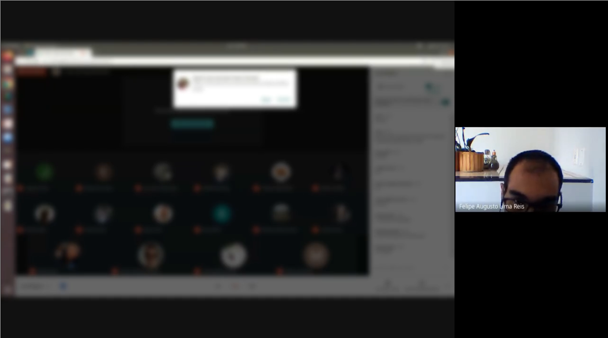

# Google Meet Blur

This code blurs Google Meet chat and participants, for privacy.

This code is developed to be as simple as possible. 
It identifies when the screen is open in Google Meet (using simple image areas comparison) and blurs the Google Meet participants pictures and chat.

The code is available under MIT License.

Some examples (after blur):




## Instalation

To run this code is necessary to use ffmpeg.

The code can be run over Anaconda environment, import *meet-blur.yml* configuration file.

---
## Usefull ffmpeg commands

Just some usefull ffmpeg commands...

Reduce mp4 video quality (24 fps/s and 960x540 display)
```
ffmpeg -i input.mp4 -vcodec libx265 -crf 24 -s 960x540 output.mp4
```

Cut video (from begining for 10 minutes)
```
ffmpeg -ss 00:00:00.0 -i input.mp4 -c copy -t 00:10:00.0 output.mp4
```

Cut video (from 30 seconds for 10 more seconds)
```
ffmpeg -ss 00:00:30.0 -i input.mp4 -c copy -t 00:00:10.0 output.mp4
```

Cut video (from begining for 10 minutes)
```
ffmpeg -ss 00:00:00.0 -i input.mp4 -c copy -t 00:10:00.0 output.mp4
```
