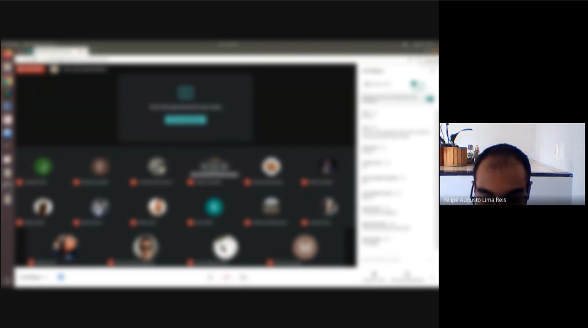
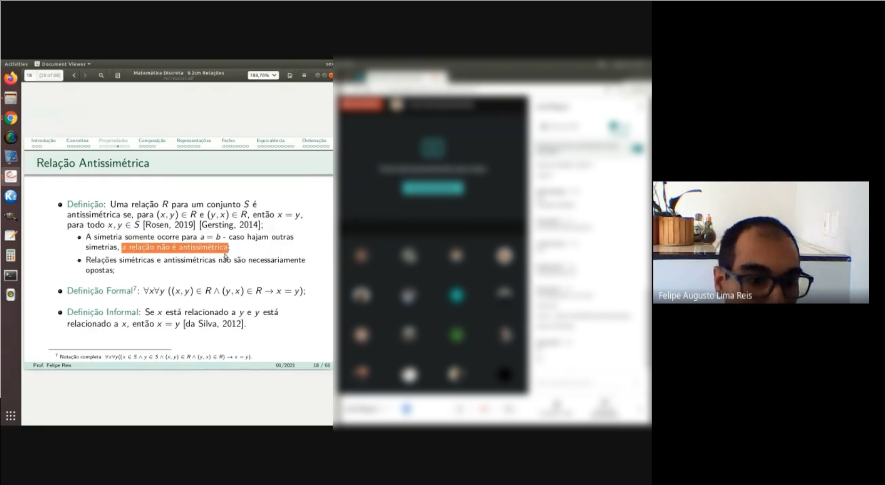

# Google Meet Blur

This code blurs Google Meet chat and participants, for privacy.

This code is developed to be as simple as possible. 
It identifies when the screen is open in Google Meet (using simple image areas comparison) and blurs the Google Meet participants pictures and chat.

The code is available under MIT License.

Some examples (after blur):

